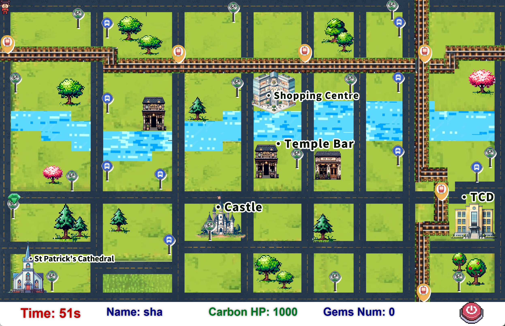

## Land of Lustrous - JavaFX Low-Carbon Educational Game

### Project Overview

This project presents a Java-based educational game designed to promote eco-friendly transportation behavior through gamification. Targeted primarily at school students, the game simulates a real-world urban map where players must collect randomly generated gems within a limited time and carbon consumption budget.

The game includes two playable levels based on simplified real maps of Dublin. Players navigate using various transportation modes—walking, bike, bus, and rail—each with different speeds and carbon costs. When a gem appears, players must strategically choose a route based on travel time and carbon usage. 

The system is built entirely with Java and JavaFX, following the MVC architecture. The game logic, UI interactions, map rendering, and route animations are all implemented in Java. Game records are saved locally via text files, with ranking data dynamically parsed and displayed in the interface.

This project was originally developed in an academic collaboration by Sha Luo, Zhiteng Tan, Yuhan Hu, Bingyang Li and Han Zheng. As a core contributor, I was responsible for the overall game logic, MVC restructuring, and interactive UI design. A detailed breakdown of my contributions is provided in the final section of this document.  In this updated version, I also reorganized the project structure, fixed missing fonts, and added a detailed README document.

---

###  Tech Stack

- **Language**: Java
- **UI Framework**: JavaFX
- **Architecture**: MVC (Model-View-Controller)
- **Pathfinding Algorithm**: A* & roaming strategy
- **Build Tool**: Maven (with Maven Wrapper)
- **Storage**: Local text file (for game record & leaderboard)
- **Design**: Photoshop for map & UI assets, JavaFX `style.css`

---

###  Project Structure

```
land-of-lustrous/
├── src/
│   └── main/
│       ├── java/
│       │   └── org.example.landoflustrous/
│       │       ├── controller/            # Controllers for different scenes (MVC)
│       │       ├── model/                 # Game data models: map, player, gem, etc.
│       │       ├── service/               # Core logic such as navigation and strategy
│       │       ├── util/                  # Helper utility classes
│       │       ├── view/                  # JavaFX view scenes (UI layout and logic)
│       │       └── GameApplication.java   # Main entry point of the JavaFX game
│       └── resources/
│           ├── fonts/                     # Fonts files
│           ├── screenshots/               # Images for README.md
│           ├── audio/                     # Background music files
│           ├── images/                    # Visual assets for maps, icons, characters
│           ├── map_data/                  # Text-based map and transport data files
│           ├── game_records1.txt          # Local game record for level 1
│           ├── game_records2.txt          # Local game record for level 2
│           └── style.css                  # UI style definitions (JavaFX CSS)
├── pom.xml                                # Maven build configuration
├── mvnw / mvnw.cmd                        # Maven wrapper scripts
├── .mvn/                                  # Maven wrapper settings
├── .gitignore                             # Git ignore rules
└── README.md                              # Project overview and instructions

```

---

### Game Flow & Features

#### **●  Start Screen & Storyline Introduction**

Players are first welcomed with an introduction and asked to enter their names before beginning the journey. They can also choose to exit the game via a button on the start screen.


#### ● **Level Selection**

Players can select between two maps: a simplified campus map (UCD) and a downtown Dublin map. They can also click the Return button to go back to the previous screen and modify their name if needed.


#### **●  Map View and Random Gem Appearance**

Once a level starts, gems appear randomly on the map. The player starts from the top-left corner and can click on gems to begin collecting them. Each gem remains visible for a limited and unpredictable amount of time—if not collected in time, it disappears. Players must react quickly to seize the opportunity before the gem vanishes.

Each level lasts **60 seconds**, and players have a limited amount of **Carbon HP**, which is consumed based on the travel mode they choose. To pass the level, players must collect **at least 5 gems** within the time and carbon constraints.


#### **●  Route Selection with Carbon Cost**

Upon clicking a gem, players are presented with three possible routes, each featuring different transport modes — including walking, biking, driving, and taking the bus — with corresponding Carbon HP costs based on travel speed. Players must make smart choices to balance limited time and environmental impact. If none of the routes are ideal, players may also choose to skip the current gem and wait for the next one to appear.


#### **●  Automatic Movement and Gem Collection**

After selecting a route, the player character automatically travels to the gem using the chosen transport modes. Upon arrival, the gem is collected, Carbon HP is deducted accordingly, and the player’s status (gems number, carbon HP) is updated in real time.


#### ● Pass & Result Screen with Leaderboard

If players collect 5 or more gems, they pass the level. The result screen shows their performance and a local leaderboard. Players who pass can also proceed to the next level. Additionally, a random eco-friendly tip is displayed to enrich the player’s environmental knowledge and promote sustainability awareness.


Failing to meet the goal brings up an end scene. Players can choose to restart the level and try again.


#### ● Advanced Level: Downtown Map with Richer Transport Options

In the second level, the map is set in the downtown area of Dublin. Compared to the campus map, this level introduces a wider variety of transport options, including LUAS (light rail). Gems in this level appear for a shorter duration, requiring players to react quickly and make timely decisions to succeed.



### Personal Contributions
As a core contributor, I was responsible for the following areas:
- Designed and implemented the core game logic, including the rules for level progression.
- Refactored and modularized multiple scenes and their corresponding controllers according to MVC architecture.

- Implemented key gameplay mechanics:

  - Players can choose between different levels (maps), and each level can be replayed after completion or failure.
  - 60-second countdown timer per level.

  - Gems appear continuously and randomly on the map.

  - Clicking on a gem displays route options with transport modes, carbon HP cost, and time.

  - Players can choose to skip a gem and wait for the next one.

  - Player moves at different speeds based on the selected transport mode, and their appearance dynamically changes to match the selected transportation method (e.g., walking, biking, driving).

  - Collecting a gem reduces the player’s remaining Carbon HP according to the selected route.

  - Added user input feature to allow players to enter and display their names.

  - Enabled local saving and displaying of game scores in `GamePassScene` and `GameOverScene`.

- Designed nearly all visual aspects of the game, including:

  - Layout and structure for all scenes
  - `style.css` for UI styling

  - In-game maps, background assets, and various game visuals

- Designed and structured `.txt` map files to encode roads, transport points, and terrain types for level rendering and route planning.
